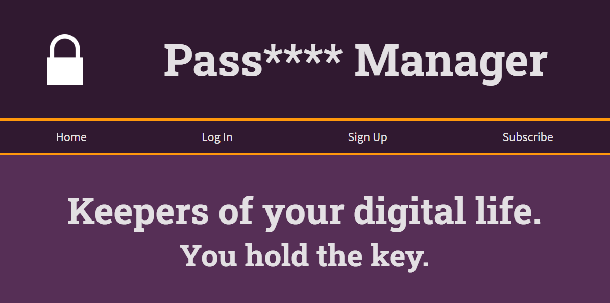
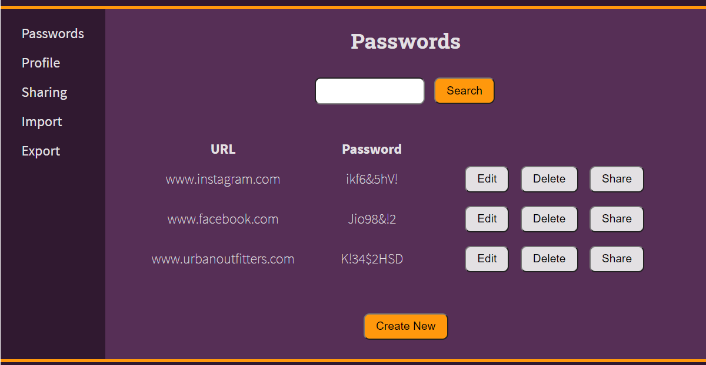

<!-- PROJECT SHIELDS -->
<!--
*** I'm using markdown "reference style" links for readability.
*** Reference links are enclosed in brackets [ ] instead of parentheses ( ).
*** See the bottom of this document for the declaration of the reference variables
*** for contributors-url, forks-url, etc. This is an optional, concise syntax you may use.
*** https://www.markdownguide.org/basic-syntax/#reference-style-links
-->

<!-- PROJECT LOGO -->
 

  

  <h3 align="center">Password Manager</h3>

  

    An app to help you manage your online passwords. In addition to managing your own passwords, this app allows you to share passwords with another user. 
     
     
    <a href="https://github.com/ntrpi/PasswordManager">View Demo</a>
    ·
    <a href="https://github.com/ntrpi/PasswordManager/issues">Report Bug</a>
    ·
    <a href="https://github.com/ntrpi/PasswordManager/issues">Request Feature</a>
  

<!-- TABLE OF CONTENTS -->

  
<h2 style="display: inline-block">Table of Contents</h2>

  <ol>
    <li>
      <a href="#about-the-project">About The Project</a>
      <ul>
        <li><a href="#built-with">Built With</a></li>
      </ul>
    </li>
    <li><a href="#features">Features</a>
      <ul>
        <li><a href="#account">Account</a></li>
        <li><a href="#login">Login</a></li>
        <li><a href="#import-and-export">Import and Export</a></li>
      </ul>
    </li>
    <li><a href="#contributions">Contributions</a></li>
    <li><a href="#acknowledgements">Acknowledgements</a></li>
  </ol>

<!-- ABOUT THE PROJECT -->
## About The Project

 

    

 
This app was created as the group project for the <a href="https://humber.ca/course/web-application-development-2">HTTP5202 PHP</a> class of the <a href="https://mediaarts.humber.ca/programs/web-development.html">Web Development program</a> at <a href="https://humber.ca/">Humber College</a>. The goal is to showcase our knowledge of server-rendered, database-driven websites.

### Built With

* [PHP](https://www.php.net/)
* [MySql](https://www.mysql.com/)

<!-- FEATURES -->
## Features

### Account
Create an account to being using the app. The accounts are identified either by the unique primary key, available only to admins, or by user name, which is confirmed as unique before creating the account.

### Login
Once the account is created, the user is logged in. For subsequent logins, the user is required to enter their unique user name and password combination. Once logged in, the user has access to the other features.

### Import and Export

<!-- CONTRIBUTIONS -->
## Contributions

* Amanda
* Barb
* Elle
* Sandra
    * <a href="#account">Account</a>
    * <a href="#login">Login</a>
    * <a href="#import-and-export">Import and Export</a>
* Wafa

<!-- CONTACT -->
## Contact

* Amanda
* Barb
* Elle
* Sandra - kupfer.sandra@gamil.com
* Wafa

Project Link: [https://github.com/ntrpi/PasswordManager](https://github.com/ntrpi/PasswordManager)

<!-- ACKNOWLEDGEMENTS -->
## Acknowledgements

* [Nithya Thayananthan](nithya.thayananthan@humber.ca)
* [Best README Template](https://github.com/othneildrew/Best-README-Template)

